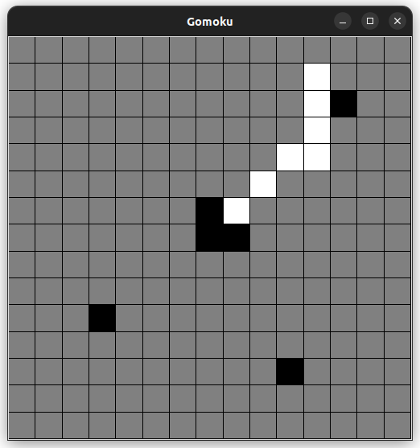

# Gomoku

Минимакс для игры Пять в ряд (Гомоку) с альфа-бета отсечением.



## Запуск
Для графического интерфейса используется tkinter.

Для управления зависимостями используется [poetry](https://python-poetry.org/),
требуется Python 3.10.

Установка зависимостей и запуск игры:

```
poetry install
poetry run python src/main.py
```

Настройки игры находятся в src/config.py:
```
    BOARD_SIZE = ... (Размер игрового поля, должно быть кратно 5)
    PLAYER_COLOR = ... (WHITE/BLACK, цвет игрока)
```